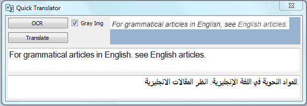
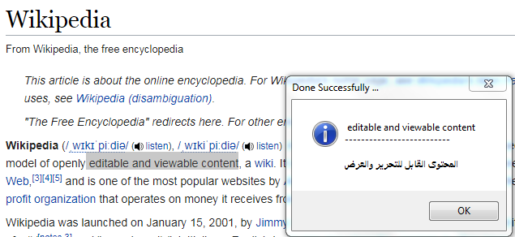

# Quick Translator, Beta Version 

#### This project support two methods of translation 
##### You can translate a text from screen directly 
1. By pressing {Shift} + {Ctrl}, the program will capture the screen and make the user selects the the text area directly 
2. The program will process the image to extract the text ( i.e. OCR, Optical Character Recognition )
3. Finally, Translation will be done using Google translation service
##### The second method allows you to translate from Clipboard directly
1. You can select a text and copy it by pressing {Ctrl} + {C}
2. Then press {Ctrl} + {Alt} and the program will translate the text using Google translation service

### Notes : 
* The program will run in the background
* The translation needs internet access, to use the Google translation service 
* Unfortunately, This project currently is just supporting English-To-Arabic Translation, However, it can be expaneded easily to another languages 

# Screenshot : 

# TODO : 
- [ ] Use RegisterHotKey API to support more hot keys 
- [ ] Support other languages 
- [ ] Improve and design auto correction system to handle OCR process output 
- [ ] Support other translation engines 

##### This project is no longer supported due to lack of time. Also, I asked a firend of mine to make a similar version for Linux (https://github.com/mosheto/JTranslator).

## Buy me a Coffee: 
BTC: bc1q2kqvggm552h0csyr0awa2zepdapxdqnacw0z5w

